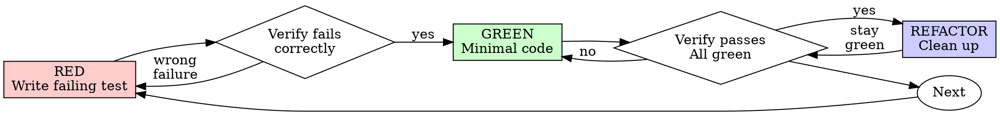

# tdd-expert

<!-- tdd -->
Generate tests, analyze coverage, and validate test quality using the TDD Guide skill.

## Usage

```
/tdd generate <file-or-dir>     Generate tests for source files
/tdd coverage <test-dir>        Analyze test coverage and gaps
/tdd validate <test-file>       Validate test quality (assertions, edge cases)
```

## Examples

```
/tdd generate src/auth/login.ts
/tdd coverage tests/ --threshold 80
/tdd validate tests/auth.test.ts
```

## Scripts
- `engineering-team/tdd-guide/scripts/test_generator.py` — Test case generation (library module)
- `engineering-team/tdd-guide/scripts/coverage_analyzer.py` — Coverage analysis (library module)
- `engineering-team/tdd-guide/scripts/tdd_workflow.py` — TDD workflow orchestration (library module)
- `engineering-team/tdd-guide/scripts/fixture_generator.py` — Test fixture generation (library module)
- `engineering-team/tdd-guide/scripts/metrics_calculator.py` — TDD metrics calculation (library module)

> **Note:** These scripts are library modules without CLI entry points. Import them in Python or use via the SKILL.md workflow guidance.

## Skill Reference
→ `engineering-team/tdd-guide/SKILL.md`


<!-- MERGED INTO: tdd-expert on 2026-04-18 -->
<!-- Use `tdd-expert` instead. -->

---

<!-- tdd-guide -->
Test-driven development skill for generating tests, analyzing coverage, and guiding red-green-refactor workflows across Jest, Pytest, JUnit, and Vitest.

---

## Workflows

### Generate Tests from Code

1. Provide source code (TypeScript, JavaScript, Python, Java)
2. Specify target framework (Jest, Pytest, JUnit, Vitest)
3. Run `test_generator.py` with requirements
4. Review generated test stubs
5. **Validation:** Tests compile and cover happy path, error cases, edge cases

### Analyze Coverage Gaps

1. Generate coverage report from test runner (`npm test -- --coverage`)
2. Run `coverage_analyzer.py` on LCOV/JSON/XML report
3. Review prioritized gaps (P0/P1/P2)
4. Generate missing tests for uncovered paths
5. **Validation:** Coverage meets target threshold (typically 80%+)

### TDD New Feature

1. Write failing test first (RED)
2. Run `tdd_workflow.py --phase red` to validate
3. Implement minimal code to pass (GREEN)
4. Run `tdd_workflow.py --phase green` to validate
5. Refactor while keeping tests green (REFACTOR)
6. **Validation:** All tests pass after each cycle

---

## Examples

### Test Generation — Input → Output (Pytest)

**Input source function (`math_utils.py`):**
```python
def divide(a: float, b: float) -> float:
    if b == 0:
        raise ValueError("Cannot divide by zero")
    return a / b
```

**Command:**
```bash
python scripts/test_generator.py --input math_utils.py --framework pytest
```

**Generated test output (`test_math_utils.py`):**
```python
import pytest
from math_utils import divide

class TestDivide:
    def test_divide_positive_numbers(self):
        assert divide(10, 2) == 5.0

    def test_divide_negative_numerator(self):
        assert divide(-10, 2) == -5.0

    def test_divide_float_result(self):
        assert divide(1, 3) == pytest.approx(0.333, rel=1e-3)

    def test_divide_by_zero_raises_value_error(self):
        with pytest.raises(ValueError, match="Cannot divide by zero"):
            divide(10, 0)

    def test_divide_zero_numerator(self):
        assert divide(0, 5) == 0.0
```

---

### Coverage Analysis — Sample P0/P1/P2 Output

**Command:**
```bash
python scripts/coverage_analyzer.py --report lcov.info --threshold 80
```

**Sample output:**
```
Coverage Report — Overall: 63% (threshold: 80%)

P0 — Critical gaps (uncovered error paths):
  auth/login.py:42-58   handle_expired_token()       0% covered
  payments/process.py:91-110  handle_payment_failure()   0% covered

P1 — High-value gaps (core logic branches):
  users/service.py:77   update_profile() — else branch  0% covered
  orders/cart.py:134    apply_discount() — zero-qty guard  0% covered

P2 — Low-risk gaps (utility / helper functions):
  utils/formatting.py:12  format_currency()            0% covered

Recommended: Generate tests for P0 items first to reach 80% threshold.
```

---

## Key Tools

| Tool | Purpose | Usage |
|------|---------|-------|
| `test_generator.py` | Generate test cases from code/requirements | `python scripts/test_generator.py --input source.py --framework pytest` |
| `coverage_analyzer.py` | Parse and analyze coverage reports | `python scripts/coverage_analyzer.py --report lcov.info --threshold 80` |
| `tdd_workflow.py` | Guide red-green-refactor cycles | `python scripts/tdd_workflow.py --phase red --test test_auth.py` |
| `fixture_generator.py` | Generate test data and mocks | `python scripts/fixture_generator.py --entity User --count 5` |

Additional scripts: `framework_adapter.py` (convert between frameworks), `metrics_calculator.py` (quality metrics), `format_detector.py` (detect language/framework), `output_formatter.py` (CLI/desktop/CI output).

---

## Input Requirements

**For Test Generation:**
- Source code (file path or pasted content)
- Target framework (Jest, Pytest, JUnit, Vitest)
- Coverage scope (unit, integration, edge cases)

**For Coverage Analysis:**
- Coverage report file (LCOV, JSON, or XML format)
- Optional: Source code for context
- Optional: Target threshold percentage

**For TDD Workflow:**
- Feature requirements or user story
- Current phase (RED, GREEN, REFACTOR)
- Test code and implementation status

---

## Spec-First Workflow

TDD is most effective when driven by a written spec. The flow:

1. **Write or receive a spec** — stored in `specs/<feature>.md`
2. **Extract acceptance criteria** — each criterion becomes one or more test cases
3. **Write failing tests (RED)** — one test per acceptance criterion
4. **Implement minimal code (GREEN)** — satisfy each test in order
5. **Refactor** — clean up while all tests stay green

### Spec Directory Convention

```
project/
├── specs/
│   ├── user-auth.md          # Feature spec with acceptance criteria
│   ├── payment-processing.md
│   └── notification-system.md
├── tests/
│   ├── test_user_auth.py     # Tests derived from specs/user-auth.md
│   ├── test_payments.py
│   └── test_notifications.py
└── src/
```

### Extracting Tests from Specs

Each acceptance criterion in a spec maps to at least one test:

| Spec Criterion | Test Case |
|---------------|-----------|
| "User can log in with valid credentials" | `test_login_valid_credentials_returns_token` |
| "Invalid password returns 401" | `test_login_invalid_password_returns_401` |
| "Account locks after 5 failed attempts" | `test_login_locks_after_five_failures` |

**Tip:** Number your acceptance criteria in the spec. Reference the number in the test docstring for traceability (`# AC-3: Account locks after 5 failed attempts`).

> **Cross-reference:** See `engineering/spec-driven-workflow` for the full spec methodology, including spec templates and review checklists.

---

## Red-Green-Refactor Examples Per Language

### TypeScript / Jest

```typescript
// test/cart.test.ts
describe("Cart", () => {
  describe("addItem", () => {
    it("should add a new item to an empty cart", () => {
      const cart = new Cart();
      cart.addItem({ id: "sku-1", name: "Widget", price: 9.99, qty: 1 });

      expect(cart.items).toHaveLength(1);
      expect(cart.items[0].id).toBe("sku-1");
    });

    it("should increment quantity when adding an existing item", () => {
      const cart = new Cart();
      cart.addItem({ id: "sku-1", name: "Widget", price: 9.99, qty: 1 });
      cart.addItem({ id: "sku-1", name: "Widget", price: 9.99, qty: 2 });

      expect(cart.items).toHaveLength(1);
      expect(cart.items[0].qty).toBe(3);
    });

    it("should throw when quantity is zero or negative", () => {
      const cart = new Cart();
      expect(() =>
        cart.addItem({ id: "sku-1", name: "Widget", price: 9.99, qty: 0 })
      ).toThrow("Quantity must be positive");
    });
  });
});
```

### Python / Pytest (Advanced Patterns)

```python
# tests/conftest.py — shared fixtures
import pytest
from app.db import create_engine, Session

@pytest.fixture(scope="session")
def db_engine():
    engine = create_engine("sqlite:///:memory:")
    yield engine
    engine.dispose()

@pytest.fixture
def db_session(db_engine):
    session = Session(bind=db_engine)
    yield session
    session.rollback()
    session.close()

# tests/test_pricing.py — parametrize for multiple cases
import pytest
from app.pricing import calculate_discount

@pytest.mark.parametrize("subtotal, expected_discount", [
    (50.0, 0.0),       # Below threshold — no discount
    (100.0, 5.0),      # 5% tier
    (250.0, 25.0),     # 10% tier
    (500.0, 75.0),     # 15% tier
])
def test_calculate_discount(subtotal, expected_discount):
    assert calculate_discount(subtotal) == pytest.approx(expected_discount)
```

### Go — Table-Driven Tests

```go
// cart_test.go
package cart

import "testing"

func TestApplyDiscount(t *testing.T) {
    tests := []struct {
        name     string
        subtotal float64
        want     float64
    }{
        {"no discount below threshold", 50.0, 0.0},
        {"5 percent tier", 100.0, 5.0},
        {"10 percent tier", 250.0, 25.0},
        {"15 percent tier", 500.0, 75.0},
        {"zero subtotal", 0.0, 0.0},
    }

    for _, tt := range tests {
        t.Run(tt.name, func(t *testing.T) {
            got := ApplyDiscount(tt.subtotal)
            if got != tt.want {
                t.Errorf("ApplyDiscount(%v) = %v, want %v", tt.subtotal, got, tt.want)
            }
        })
    }
}
```

---

## Bounded Autonomy Rules

When generating tests autonomously, follow these rules to decide when to stop and ask the user:

### Stop and Ask When

- **Ambiguous requirements** — the spec or user story has conflicting or unclear acceptance criteria
- **Missing edge cases** — you cannot determine boundary values without domain knowledge (e.g., max allowed transaction amount)
- **Test count exceeds 50** — large test suites need human review before committing; present a summary and ask which areas to prioritize
- **External dependencies unclear** — the feature relies on third-party APIs or services with undocumented behavior
- **Security-sensitive logic** — authentication, authorization, encryption, or payment flows require human sign-off on test scenarios

### Continue Autonomously When

- **Clear spec with numbered acceptance criteria** — each criterion maps directly to tests
- **Straightforward CRUD operations** — create, read, update, delete with well-defined models
- **Well-defined API contracts** — OpenAPI spec or typed interfaces available
- **Pure functions** — deterministic input/output with no side effects
- **Existing test patterns** — the codebase already has similar tests to follow

---

## Property-Based Testing

Property-based testing generates random inputs to verify invariants instead of relying on hand-picked examples. Use it when the input space is large and the expected behavior can be described as a property.

### Python — Hypothesis

```python
from hypothesis import given, strategies as st
from app.serializers import serialize, deserialize

@given(st.text())
def test_roundtrip_serialization(data):
    """Serialization followed by deserialization returns the original."""
    assert deserialize(serialize(data)) == data

@given(st.integers(), st.integers())
def test_addition_is_commutative(a, b):
    assert a + b == b + a
```

### TypeScript — fast-check

```typescript
import fc from "fast-check";
import { encode, decode } from "./codec";

test("encode/decode roundtrip", () => {
  fc.assert(
    fc.property(fc.string(), (input) => {
      expect(decode(encode(input))).toBe(input);
    })
  );
});
```

### When to Use Property-Based Over Example-Based

| Use Property-Based | Example |
|-------------------|---------|
| Data transformations | Serialize/deserialize roundtrips |
| Mathematical properties | Commutativity, associativity, idempotency |
| Encoding/decoding | Base64, URL encoding, compression |
| Sorting and filtering | Output is sorted, length preserved |
| Parser correctness | Valid input always parses without error |

---

## Mutation Testing

Mutation testing modifies your production code (creates "mutants") and checks whether your tests catch the changes. If a mutant survives (tests still pass), your tests have a gap that coverage alone cannot reveal.

### Tools

| Language | Tool | Command |
|----------|------|---------|
| TypeScript/JavaScript | **Stryker** | `npx stryker run` |
| Python | **mutmut** | `mutmut run --paths-to-mutate=src/` |
| Java | **PIT** | `mvn org.pitest:pitest-maven:mutationCoverage` |

### Why Mutation Testing Matters

- **100% line coverage != good tests** — coverage tells you code was executed, not that it was verified
- **Catches weak assertions** — tests that run code but assert nothing meaningful
- **Finds missing boundary tests** — mutants that change `<` to `<=` expose off-by-one gaps
- **Quantifiable quality metric** — mutation score (% mutants killed) is a stronger signal than coverage %

**Recommendation:** Run mutation testing on critical paths (auth, payments, data processing) even if overall coverage is high. Target 85%+ mutation score on P0 modules.

---

## Cross-References

| Skill | Relationship |
|-------|-------------|
| `engineering/spec-driven-workflow` | Spec → acceptance criteria → test extraction pipeline |
| `engineering-team/focused-fix` | Phase 5 (Verify) uses TDD to confirm the fix with a regression test |
| `engineering-team/senior-qa` | Broader QA strategy; TDD is one layer in the test pyramid |
| `engineering-team/code-reviewer` | Review generated tests for assertion quality and coverage completeness |
| `engineering-team/senior-fullstack` | Project scaffolders include testing infrastructure compatible with TDD workflows |

---

## Limitations

| Scope | Details |
|-------|---------|
| Unit test focus | Integration and E2E tests require different patterns |
| Static analysis | Cannot execute tests or measure runtime behavior |
| Language support | Best for TypeScript, JavaScript, Python, Java |
| Report formats | LCOV, JSON, XML only; other formats need conversion |
| Generated tests | Provide scaffolding; require human review for complex logic |

**When to use other tools:**
- E2E testing: Playwright, Cypress, Selenium
- Performance testing: k6, JMeter, Locust
- Security testing: OWASP ZAP, Burp Suite


<!-- MERGED INTO: tdd-expert on 2026-04-18 -->
<!-- Use `tdd-expert` instead. -->

---

<!-- tdd-workflow -->
> Write tests first, code second.

---

## 1. The TDD Cycle

```
🔴 RED → Write failing test
    ↓
🟢 GREEN → Write minimal code to pass
    ↓
🔵 REFACTOR → Improve code quality
    ↓
   Repeat...
```

---

## 2. The Three Laws of TDD

1. Write production code only to make a failing test pass
2. Write only enough test to demonstrate failure
3. Write only enough code to make the test pass

---

## 3. RED Phase Principles

### What to Write

| Focus | Example |
|-------|---------|
| Behavior | "should add two numbers" |
| Edge cases | "should handle empty input" |
| Error states | "should throw for invalid data" |

### RED Phase Rules

- Test must fail first
- Test name describes expected behavior
- One assertion per test (ideally)

---

## 4. GREEN Phase Principles

### Minimum Code

| Principle | Meaning |
|-----------|---------|
| **YAGNI** | You Aren't Gonna Need It |
| **Simplest thing** | Write the minimum to pass |
| **No optimization** | Just make it work |

### GREEN Phase Rules

- Don't write unneeded code
- Don't optimize yet
- Pass the test, nothing more

---

## 5. REFACTOR Phase Principles

### What to Improve

| Area | Action |
|------|--------|
| Duplication | Extract common code |
| Naming | Make intent clear |
| Structure | Improve organization |
| Complexity | Simplify logic |

### REFACTOR Rules

- All tests must stay green
- Small incremental changes
- Commit after each refactor

---

## 6. AAA Pattern

Every test follows:

| Step | Purpose |
|------|---------|
| **Arrange** | Set up test data |
| **Act** | Execute code under test |
| **Assert** | Verify expected outcome |

---

## 7. When to Use TDD

| Scenario | TDD Value |
|----------|-----------|
| New feature | High |
| Bug fix | High (write test first) |
| Complex logic | High |
| Exploratory | Low (spike, then TDD) |
| UI layout | Low |

---

## 8. Test Prioritization

| Priority | Test Type |
|----------|-----------|
| 1 | Happy path |
| 2 | Error cases |
| 3 | Edge cases |
| 4 | Performance |

---

## 9. Anti-Patterns

| ❌ Don't | ✅ Do |
|----------|-------|
| Skip the RED phase | Watch test fail first |
| Write tests after | Write tests before |
| Over-engineer initial | Keep it simple |
| Multiple asserts | One behavior per test |
| Test implementation | Test behavior |

---

## 10. AI-Augmented TDD

### Multi-Agent Pattern

| Agent | Role |
|-------|------|
| Agent A | Write failing tests (RED) |
| Agent B | Implement to pass (GREEN) |
| Agent C | Optimize (REFACTOR) |

---

> **Remember:** The test is the specification. If you can't write a test, you don't understand the requirement.

## When to Use
This skill is applicable to execute the workflow or actions described in the overview.


<!-- MERGED INTO: tdd-expert on 2026-04-18 -->
<!-- Use `tdd-expert` instead. -->

---

<!-- tdd-workflows-tdd-cycle -->
## Use this skill when

- Working on tdd workflows tdd cycle tasks or workflows
- Needing guidance, best practices, or checklists for tdd workflows tdd cycle

## Do not use this skill when

- The task is unrelated to tdd workflows tdd cycle
- You need a different domain or tool outside this scope

## Instructions

- Clarify goals, constraints, and required inputs.
- Apply relevant best practices and validate outcomes.
- Provide actionable steps and verification.
- If detailed examples are required, open `resources/implementation-playbook.md`.

Execute a comprehensive Test-Driven Development (TDD) workflow with strict red-green-refactor discipline:

[Extended thinking: This workflow enforces test-first development through coordinated agent orchestration. Each phase of the TDD cycle is strictly enforced with fail-first verification, incremental implementation, and continuous refactoring. The workflow supports both single test and test suite approaches with configurable coverage thresholds.]

## Configuration

### Coverage Thresholds
- Minimum line coverage: 80%
- Minimum branch coverage: 75%
- Critical path coverage: 100%

### Refactoring Triggers
- Cyclomatic complexity > 10
- Method length > 20 lines
- Class length > 200 lines
- Duplicate code blocks > 3 lines

## Phase 1: Test Specification and Design

### 1. Requirements Analysis
- Use Task tool with subagent_type="comprehensive-review::architect-review"
- Prompt: "Analyze requirements for: $ARGUMENTS. Define acceptance criteria, identify edge cases, and create test scenarios. Output a comprehensive test specification."
- Output: Test specification, acceptance criteria, edge case matrix
- Validation: Ensure all requirements have corresponding test scenarios

### 2. Test Architecture Design
- Use Task tool with subagent_type="unit-testing::test-automator"
- Prompt: "Design test architecture for: $ARGUMENTS based on test specification. Define test structure, fixtures, mocks, and test data strategy. Ensure testability and maintainability."
- Output: Test architecture, fixture design, mock strategy
- Validation: Architecture supports isolated, fast, reliable tests

## Phase 2: RED - Write Failing Tests

### 3. Write Unit Tests (Failing)
- Use Task tool with subagent_type="unit-testing::test-automator"
- Prompt: "Write FAILING unit tests for: $ARGUMENTS. Tests must fail initially. Include edge cases, error scenarios, and happy paths. DO NOT implement production code."
- Output: Failing unit tests, test documentation
- **CRITICAL**: Verify all tests fail with expected error messages

### 4. Verify Test Failure
- Use Task tool with subagent_type="tdd-workflows::code-reviewer"
- Prompt: "Verify that all tests for: $ARGUMENTS are failing correctly. Ensure failures are for the right reasons (missing implementation, not test errors). Confirm no false positives."
- Output: Test failure verification report
- **GATE**: Do not proceed until all tests fail appropriately

## Phase 3: GREEN - Make Tests Pass

### 5. Minimal Implementation
- Use Task tool with subagent_type="backend-development::backend-architect"
- Prompt: "Implement MINIMAL code to make tests pass for: $ARGUMENTS. Focus only on making tests green. Do not add extra features or optimizations. Keep it simple."
- Output: Minimal working implementation
- Constraint: No code beyond what's needed to pass tests

### 6. Verify Test Success
- Use Task tool with subagent_type="unit-testing::test-automator"
- Prompt: "Run all tests for: $ARGUMENTS and verify they pass. Check test coverage metrics. Ensure no tests were accidentally broken."
- Output: Test execution report, coverage metrics
- **GATE**: All tests must pass before proceeding

## Phase 4: REFACTOR - Improve Code Quality

### 7. Code Refactoring
- Use Task tool with subagent_type="tdd-workflows::code-reviewer"
- Prompt: "Refactor implementation for: $ARGUMENTS while keeping tests green. Apply SOLID principles, remove duplication, improve naming, and optimize performance. Run tests after each refactoring."
- Output: Refactored code, refactoring report
- Constraint: Tests must remain green throughout

### 8. Test Refactoring
- Use Task tool with subagent_type="unit-testing::test-automator"
- Prompt: "Refactor tests for: $ARGUMENTS. Remove test duplication, improve test names, extract common fixtures, and enhance test readability. Ensure tests still provide same coverage."
- Output: Refactored tests, improved test structure
- Validation: Coverage metrics unchanged or improved

## Phase 5: Integration and System Tests

### 9. Write Integration Tests (Failing First)
- Use Task tool with subagent_type="unit-testing::test-automator"
- Prompt: "Write FAILING integration tests for: $ARGUMENTS. Test component interactions, API contracts, and data flow. Tests must fail initially."
- Output: Failing integration tests
- Validation: Tests fail due to missing integration logic

### 10. Implement Integration
- Use Task tool with subagent_type="backend-development::backend-architect"
- Prompt: "Implement integration code for: $ARGUMENTS to make integration tests pass. Focus on component interaction and data flow."
- Output: Integration implementation
- Validation: All integration tests pass

## Phase 6: Continuous Improvement Cycle

### 11. Performance and Edge Case Tests
- Use Task tool with subagent_type="unit-testing::test-automator"
- Prompt: "Add performance tests and additional edge case tests for: $ARGUMENTS. Include stress tests, boundary tests, and error recovery tests."
- Output: Extended test suite
- Metric: Increased test coverage and scenario coverage

### 12. Final Code Review
- Use Task tool with subagent_type="comprehensive-review::architect-review"
- Prompt: "Perform comprehensive review of: $ARGUMENTS. Verify TDD process was followed, check code quality, test quality, and coverage. Suggest improvements."
- Output: Review report, improvement suggestions
- Action: Implement critical suggestions while maintaining green tests

## Incremental Development Mode

For test-by-test development:
1. Write ONE failing test
2. Make ONLY that test pass
3. Refactor if needed
4. Repeat for next test

Use this approach by adding `--incremental` flag to focus on one test at a time.

## Test Suite Mode

For comprehensive test suite development:
1. Write ALL tests for a feature/module (failing)
2. Implement code to pass ALL tests
3. Refactor entire module
4. Add integration tests

Use this approach by adding `--suite` flag for batch test development.

## Validation Checkpoints

### RED Phase Validation
- [ ] All tests written before implementation
- [ ] All tests fail with meaningful error messages
- [ ] Test failures are due to missing implementation
- [ ] No test passes accidentally

### GREEN Phase Validation
- [ ] All tests pass
- [ ] No extra code beyond test requirements
- [ ] Coverage meets minimum thresholds
- [ ] No test was modified to make it pass

### REFACTOR Phase Validation
- [ ] All tests still pass after refactoring
- [ ] Code complexity reduced
- [ ] Duplication eliminated
- [ ] Performance improved or maintained
- [ ] Test readability improved

## Coverage Reports

Generate coverage reports after each phase:
- Line coverage
- Branch coverage
- Function coverage
- Statement coverage

## Failure Recovery

If TDD discipline is broken:
1. **STOP** immediately
2. Identify which phase was violated
3. Rollback to last valid state
4. Resume from correct phase
5. Document lesson learned

## TDD Metrics Tracking

Track and report:
- Time in each phase (Red/Green/Refactor)
- Number of test-implementation cycles
- Coverage progression
- Refactoring frequency
- Defect escape rate

## Anti-Patterns to Avoid

- Writing implementation before tests
- Writing tests that already pass
- Skipping the refactor phase
- Writing multiple features without tests
- Modifying tests to make them pass
- Ignoring failing tests
- Writing tests after implementation

## Success Criteria

- 100% of code written test-first
- All tests pass continuously
- Coverage exceeds thresholds
- Code complexity within limits
- Zero defects in covered code
- Clear test documentation
- Fast test execution (< 5 seconds for unit tests)

## Notes

- Enforce strict RED-GREEN-REFACTOR discipline
- Each phase must be completed before moving to next
- Tests are the specification
- If a test is hard to write, the design needs improvement
- Refactoring is NOT optional
- Keep test execution fast
- Tests should be independent and isolated

TDD implementation for: $ARGUMENTS


<!-- MERGED INTO: tdd-expert on 2026-04-18 -->
<!-- Use `tdd-expert` instead. -->

---

<!-- tdd-workflows-tdd-green -->
def product_list(request):
    products = Product.objects.all()
    return JsonResponse({'products': list(products.values())})

# Refactor: Class-based view
class ProductListView(View):
    def get(self, request):
        products = Product.objects.all()
        return JsonResponse({'products': list(products.values())})

# Refactor: Generic view
class ProductListView(ListView):
    model = Product
    context_object_name = 'products'
```

### Express Patterns

**Inline → Middleware → Service Layer:**
```javascript
// Green Phase: Inline logic
app.post('/api/users', (req, res) => {
  const user = { id: Date.now(), ...req.body };
  users.push(user);
  res.json(user);
});

// Refactor: Extract middleware
app.post('/api/users', validateUser, (req, res) => {
  const user = userService.create(req.body);
  res.json(user);
});

// Refactor: Full layering
app.post('/api/users',
  validateUser,
  asyncHandler(userController.create)
);
```

## Use this skill when

- Moving from red to green in a TDD cycle
- Implementing minimal behavior to satisfy tests
- You want to keep implementation intentionally simple

## Do not use this skill when

- You are refactoring for design or performance
- Tests are already passing and you need new requirements
- You need a full architectural redesign

## Instructions

1. Review failing tests and identify the smallest fix.
2. Implement the minimal change to pass the next test.
3. Run tests after each change to confirm progress.
4. Record shortcuts or debt for the refactor phase.

## Safety

- Avoid bypassing tests to make them pass.
- Keep changes scoped to the failing behavior only.

## Resources

- `resources/implementation-playbook.md` for detailed patterns and examples.


<!-- MERGED INTO: tdd-expert on 2026-04-18 -->
<!-- Use `tdd-expert` instead. -->

---

<!-- tdd-workflows-tdd-red -->
Write comprehensive failing tests following TDD red phase principles.

[Extended thinking: Generates failing tests that properly define expected behavior using test-automator agent.]

## Use this skill when

- Starting the TDD red phase for new behavior
- You need failing tests that capture expected behavior
- You want edge case coverage before implementation

## Do not use this skill when

- You are in the green or refactor phase
- You only need performance benchmarks
- Tests must run against production systems

## Instructions

1. Identify behaviors, constraints, and edge cases.
2. Generate failing tests that define expected outcomes.
3. Ensure failures are due to missing behavior, not setup errors.
4. Document how to run tests and verify failures.

## Safety

- Keep test data isolated and avoid production environments.
- Avoid flaky external dependencies in the red phase.

## Role

Generate failing tests using Task tool with subagent_type="unit-testing::test-automator".

## Prompt Template

"Generate comprehensive FAILING tests for: $ARGUMENTS

## Core Requirements

1. **Test Structure**
   - Framework-appropriate setup (Jest/pytest/JUnit/Go/RSpec)
   - Arrange-Act-Assert pattern
   - should_X_when_Y naming convention
   - Isolated fixtures with no interdependencies

2. **Behavior Coverage**
   - Happy path scenarios
   - Edge cases (empty, null, boundary values)
   - Error handling and exceptions
   - Concurrent access (if applicable)

3. **Failure Verification**
   - Tests MUST fail when run
   - Failures for RIGHT reasons (not syntax/import errors)
   - Meaningful diagnostic error messages
   - No cascading failures

4. **Test Categories**
   - Unit: Isolated component behavior
   - Integration: Component interaction
   - Contract: API/interface contracts
   - Property: Mathematical invariants

## Framework Patterns

**JavaScript/TypeScript (Jest/Vitest)**
- Mock dependencies with `vi.fn()` or `jest.fn()`
- Use `@testing-library` for React components
- Property tests with `fast-check`

**Python (pytest)**
- Fixtures with appropriate scopes
- Parametrize for multiple test cases
- Hypothesis for property-based tests

**Go**
- Table-driven tests with subtests
- `t.Parallel()` for parallel execution
- Use `testify/assert` for cleaner assertions

**Ruby (RSpec)**
- `let` for lazy loading, `let!` for eager
- Contexts for different scenarios
- Shared examples for common behavior

## Quality Checklist

- Readable test names documenting intent
- One behavior per test
- No implementation leakage
- Meaningful test data (not 'foo'/'bar')
- Tests serve as living documentation

## Anti-Patterns to Avoid

- Tests passing immediately
- Testing implementation vs behavior
- Complex setup code
- Multiple responsibilities per test
- Brittle tests tied to specifics

## Edge Case Categories

- **Null/Empty**: undefined, null, empty string/array/object
- **Boundaries**: min/max values, single element, capacity limits
- **Special Cases**: Unicode, whitespace, special characters
- **State**: Invalid transitions, concurrent modifications
- **Errors**: Network failures, timeouts, permissions

## Output Requirements

- Complete test files with imports
- Documentation of test purpose
- Commands to run and verify failures
- Metrics: test count, coverage areas
- Next steps for green phase"

## Validation

After generation:
1. Run tests - confirm they fail
2. Verify helpful failure messages
3. Check test independence
4. Ensure comprehensive coverage

## Example (Minimal)

```typescript
// auth.service.test.ts
describe('AuthService', () => {
  let authService: AuthService;
  let mockUserRepo: jest.Mocked<UserRepository>;

  beforeEach(() => {
    mockUserRepo = { findByEmail: jest.fn() } as any;
    authService = new AuthService(mockUserRepo);
  });

  it('should_return_token_when_valid_credentials', async () => {
    const user = { id: '1', email: 'test@example.com', passwordHash: 'hashed' };
    mockUserRepo.findByEmail.mockResolvedValue(user);

    const result = await authService.authenticate('test@example.com', 'pass');

    expect(result.success).toBe(true);
    expect(result.token).toBeDefined();
  });

  it('should_fail_when_user_not_found', async () => {
    mockUserRepo.findByEmail.mockResolvedValue(null);

    const result = await authService.authenticate('none@example.com', 'pass');

    expect(result.success).toBe(false);
    expect(result.error).toBe('INVALID_CREDENTIALS');
  });
});
```

Test requirements: $ARGUMENTS


<!-- MERGED INTO: tdd-expert on 2026-04-18 -->
<!-- Use `tdd-expert` instead. -->

---

<!-- tdd-workflows-tdd-refactor -->
## Use this skill when

- Working on tdd workflows tdd refactor tasks or workflows
- Needing guidance, best practices, or checklists for tdd workflows tdd refactor

## Do not use this skill when

- The task is unrelated to tdd workflows tdd refactor
- You need a different domain or tool outside this scope

## Instructions

- Clarify goals, constraints, and required inputs.
- Apply relevant best practices and validate outcomes.
- Provide actionable steps and verification.
- If detailed examples are required, open `resources/implementation-playbook.md`.

Refactor code with confidence using comprehensive test safety net:

[Extended thinking: This tool uses the tdd-orchestrator agent (opus model) for sophisticated refactoring while maintaining all tests green. It applies design patterns, improves code quality, and optimizes performance with the safety of comprehensive test coverage.]

## Usage

Use Task tool with subagent_type="tdd-orchestrator" to perform safe refactoring.

Prompt: "Refactor this code while keeping all tests green: $ARGUMENTS. Apply TDD refactor phase:

## Core Process

**1. Pre-Assessment**
- Run tests to establish green baseline
- Analyze code smells and test coverage
- Document current performance metrics
- Create incremental refactoring plan

**2. Code Smell Detection**
- Duplicated code → Extract methods/classes
- Long methods → Decompose into focused functions
- Large classes → Split responsibilities
- Long parameter lists → Parameter objects
- Feature Envy → Move methods to appropriate classes
- Primitive Obsession → Value objects
- Switch statements → Polymorphism
- Dead code → Remove

**3. Design Patterns**
- Apply Creational (Factory, Builder, Singleton)
- Apply Structural (Adapter, Facade, Decorator)
- Apply Behavioral (Strategy, Observer, Command)
- Apply Domain (Repository, Service, Value Objects)
- Use patterns only where they add clear value

**4. SOLID Principles**
- Single Responsibility: One reason to change
- Open/Closed: Open for extension, closed for modification
- Liskov Substitution: Subtypes substitutable
- Interface Segregation: Small, focused interfaces
- Dependency Inversion: Depend on abstractions

**5. Refactoring Techniques**
- Extract Method/Variable/Interface
- Inline unnecessary indirection
- Rename for clarity
- Move Method/Field to appropriate classes
- Replace Magic Numbers with constants
- Encapsulate fields
- Replace Conditional with Polymorphism
- Introduce Null Object

**6. Performance Optimization**
- Profile to identify bottlenecks
- Optimize algorithms and data structures
- Implement caching where beneficial
- Reduce database queries (N+1 elimination)
- Lazy loading and pagination
- Always measure before and after

**7. Incremental Steps**
- Make small, atomic changes
- Run tests after each modification
- Commit after each successful refactoring
- Keep refactoring separate from behavior changes
- Use scaffolding when needed

**8. Architecture Evolution**
- Layer separation and dependency management
- Module boundaries and interface definition
- Event-driven patterns for decoupling
- Database access pattern optimization

**9. Safety Verification**
- Run full test suite after each change
- Performance regression testing
- Mutation testing for test effectiveness
- Rollback plan for major changes

**10. Advanced Patterns**
- Strangler Fig: Gradual legacy replacement
- Branch by Abstraction: Large-scale changes
- Parallel Change: Expand-contract pattern
- Mikado Method: Dependency graph navigation

## Output Requirements

- Refactored code with improvements applied
- Test results (all green)
- Before/after metrics comparison
- Applied refactoring techniques list
- Performance improvement measurements
- Remaining technical debt assessment

## Safety Checklist

Before committing:
- ✓ All tests pass (100% green)
- ✓ No functionality regression
- ✓ Performance metrics acceptable
- ✓ Code coverage maintained/improved
- ✓ Documentation updated

## Recovery Protocol

If tests fail:
- Immediately revert last change
- Identify breaking refactoring
- Apply smaller incremental changes
- Use version control for safe experimentation

## Example: Extract Method Pattern

**Before:**
```typescript
class OrderProcessor {
  processOrder(order: Order): ProcessResult {
    // Validation
    if (!order.customerId || order.items.length === 0) {
      return { success: false, error: "Invalid order" };
    }

    // Calculate totals
    let subtotal = 0;
    for (const item of order.items) {
      subtotal += item.price * item.quantity;
    }
    let total = subtotal + (subtotal * 0.08) + (subtotal > 100 ? 0 : 15);

    // Process payment...
    // Update inventory...
    // Send confirmation...
  }
}
```

**After:**
```typescript
class OrderProcessor {
  async processOrder(order: Order): Promise<ProcessResult> {
    const validation = this.validateOrder(order);
    if (!validation.isValid) return ProcessResult.failure(validation.error);

    const orderTotal = OrderTotal.calculate(order);
    const inventoryCheck = await this.inventoryService.checkAvailability(order.items);
    if (!inventoryCheck.available) return ProcessResult.failure(inventoryCheck.reason);

    await this.paymentService.processPayment(order.paymentMethod, orderTotal.total);
    await this.inventoryService.reserveItems(order.items);
    await this.notificationService.sendOrderConfirmation(order, orderTotal);

    return ProcessResult.success(order.id, orderTotal.total);
  }

  private validateOrder(order: Order): ValidationResult {
    if (!order.customerId) return ValidationResult.invalid("Customer ID required");
    if (order.items.length === 0) return ValidationResult.invalid("Order must contain items");
    return ValidationResult.valid();
  }
}
```

**Applied:** Extract Method, Value Objects, Dependency Injection, Async patterns

Code to refactor: $ARGUMENTS"


<!-- MERGED INTO: tdd-expert on 2026-04-18 -->
<!-- Use `tdd-expert` instead. -->

---

<!-- test-driven-development -->
## Overview

Write the test first. Watch it fail. Write minimal code to pass.

**Core principle:** If you didn't watch the test fail, you don't know if it tests the right thing.

**Violating the letter of the rules is violating the spirit of the rules.**

## When to Use

**Always:**
- New features
- Bug fixes
- Refactoring
- Behavior changes

**Exceptions (ask your human partner):**
- Throwaway prototypes
- Generated code
- Configuration files

Thinking "skip TDD just this once"? Stop. That's rationalization.

## The Iron Law

```
NO PRODUCTION CODE WITHOUT A FAILING TEST FIRST
```

Write code before the test? Delete it. Start over.

**No exceptions:**
- Don't keep it as "reference"
- Don't "adapt" it while writing tests
- Don't look at it
- Delete means delete

Implement fresh from tests. Period.

## Red-Green-Refactor



### RED - Write Failing Test

Write one minimal test showing what should happen.

<Good>
```typescript
test('retries failed operations 3 times', async () => {
  let attempts = 0;
  const operation = () => {
    attempts++;
    if (attempts < 3) throw new Error('fail');
    return 'success';
  };

  const result = await retryOperation(operation);

  expect(result).toBe('success');
  expect(attempts).toBe(3);
});
```
Clear name, tests real behavior, one thing
</Good>

<Bad>
```typescript
test('retry works', async () => {
  const mock = jest.fn()
    .mockRejectedValueOnce(new Error())
    .mockRejectedValueOnce(new Error())
    .mockResolvedValueOnce('success');
  await retryOperation(mock);
  expect(mock).toHaveBeenCalledTimes(3);
});
```
Vague name, tests mock not code
</Bad>

**Requirements:**
- One behavior
- Clear name
- Real code (no mocks unless unavoidable)

### Verify RED - Watch It Fail

**MANDATORY. Never skip.**

```bash
npm test path/to/test.test.ts
```

Confirm:
- Test fails (not errors)
- Failure message is expected
- Fails because feature missing (not typos)

**Test passes?** You're testing existing behavior. Fix test.

**Test errors?** Fix error, re-run until it fails correctly.

### GREEN - Minimal Code

Write simplest code to pass the test.

<Good>
```typescript
async function retryOperation<T>(fn: () => Promise<T>): Promise<T> {
  for (let i = 0; i < 3; i++) {
    try {
      return await fn();
    } catch (e) {
      if (i === 2) throw e;
    }
  }
  throw new Error('unreachable');
}
```
Just enough to pass
</Good>

<Bad>
```typescript
async function retryOperation<T>(
  fn: () => Promise<T>,
  options?: {
    maxRetries?: number;
    backoff?: 'linear' | 'exponential';
    onRetry?: (attempt: number) => void;
  }
): Promise<T> {
  // YAGNI
}
```
Over-engineered
</Bad>

Don't add features, refactor other code, or "improve" beyond the test.

### Verify GREEN - Watch It Pass

**MANDATORY.**

```bash
npm test path/to/test.test.ts
```

Confirm:
- Test passes
- Other tests still pass
- Output pristine (no errors, warnings)

**Test fails?** Fix code, not test.

**Other tests fail?** Fix now.

### REFACTOR - Clean Up

After green only:
- Remove duplication
- Improve names
- Extract helpers

Keep tests green. Don't add behavior.

### Repeat

Next failing test for next feature.

## Good Tests

| Quality | Good | Bad |
|---------|------|-----|
| **Minimal** | One thing. "and" in name? Split it. | `test('validates email and domain and whitespace')` |
| **Clear** | Name describes behavior | `test('test1')` |
| **Shows intent** | Demonstrates desired API | Obscures what code should do |

## Why Order Matters

**"I'll write tests after to verify it works"**

Tests written after code pass immediately. Passing immediately proves nothing:
- Might test wrong thing
- Might test implementation, not behavior
- Might miss edge cases you forgot
- You never saw it catch the bug

Test-first forces you to see the test fail, proving it actually tests something.

**"I already manually tested all the edge cases"**

Manual testing is ad-hoc. You think you tested everything but:
- No record of what you tested
- Can't re-run when code changes
- Easy to forget cases under pressure
- "It worked when I tried it" ≠ comprehensive

Automated tests are systematic. They run the same way every time.

**"Deleting X hours of work is wasteful"**

Sunk cost fallacy. The time is already gone. Your choice now:
- Delete and rewrite with TDD (X more hours, high confidence)
- Keep it and add tests after (30 min, low confidence, likely bugs)

The "waste" is keeping code you can't trust. Working code without real tests is technical debt.

**"TDD is dogmatic, being pragmatic means adapting"**

TDD IS pragmatic:
- Finds bugs before commit (faster than debugging after)
- Prevents regressions (tests catch breaks immediately)
- Documents behavior (tests show how to use code)
- Enables refactoring (change freely, tests catch breaks)

"Pragmatic" shortcuts = debugging in production = slower.

**"Tests after achieve the same goals - it's spirit not ritual"**

No. Tests-after answer "What does this do?" Tests-first answer "What should this do?"

Tests-after are biased by your implementation. You test what you built, not what's required. You verify remembered edge cases, not discovered ones.

Tests-first force edge case discovery before implementing. Tests-after verify you remembered everything (you didn't).

30 minutes of tests after ≠ TDD. You get coverage, lose proof tests work.

## Common Rationalizations

| Excuse | Reality |
|--------|---------|
| "Too simple to test" | Simple code breaks. Test takes 30 seconds. |
| "I'll test after" | Tests passing immediately prove nothing. |
| "Tests after achieve same goals" | Tests-after = "what does this do?" Tests-first = "what should this do?" |
| "Already manually tested" | Ad-hoc ≠ systematic. No record, can't re-run. |
| "Deleting X hours is wasteful" | Sunk cost fallacy. Keeping unverified code is technical debt. |
| "Keep as reference, write tests first" | You'll adapt it. That's testing after. Delete means delete. |
| "Need to explore first" | Fine. Throw away exploration, start with TDD. |
| "Test hard = design unclear" | Listen to test. Hard to test = hard to use. |
| "TDD will slow me down" | TDD faster than debugging. Pragmatic = test-first. |
| "Manual test faster" | Manual doesn't prove edge cases. You'll re-test every change. |
| "Existing code has no tests" | You're improving it. Add tests for existing code. |

## Red Flags - STOP and Start Over

- Code before test
- Test after implementation
- Test passes immediately
- Can't explain why test failed
- Tests added "later"
- Rationalizing "just this once"
- "I already manually tested it"
- "Tests after achieve the same purpose"
- "It's about spirit not ritual"
- "Keep as reference" or "adapt existing code"
- "Already spent X hours, deleting is wasteful"
- "TDD is dogmatic, I'm being pragmatic"
- "This is different because..."

**All of these mean: Delete code. Start over with TDD.**

## Example: Bug Fix

**Bug:** Empty email accepted

**RED**
```typescript
test('rejects empty email', async () => {
  const result = await submitForm({ email: '' });
  expect(result.error).toBe('Email required');
});
```

**Verify RED**
```bash
$ npm test
FAIL: expected 'Email required', got undefined
```

**GREEN**
```typescript
function submitForm(data: FormData) {
  if (!data.email?.trim()) {
    return { error: 'Email required' };
  }
  // ...
}
```

**Verify GREEN**
```bash
$ npm test
PASS
```

**REFACTOR**
Extract validation for multiple fields if needed.

## Verification Checklist

Before marking work complete:

- [ ] Every new function/method has a test
- [ ] Watched each test fail before implementing
- [ ] Each test failed for expected reason (feature missing, not typo)
- [ ] Wrote minimal code to pass each test
- [ ] All tests pass
- [ ] Output pristine (no errors, warnings)
- [ ] Tests use real code (mocks only if unavoidable)
- [ ] Edge cases and errors covered

Can't check all boxes? You skipped TDD. Start over.

## When Stuck

| Problem | Solution |
|---------|----------|
| Don't know how to test | Write wished-for API. Write assertion first. Ask your human partner. |
| Test too complicated | Design too complicated. Simplify interface. |
| Must mock everything | Code too coupled. Use dependency injection. |
| Test setup huge | Extract helpers. Still complex? Simplify design. |

## Debugging Integration

Bug found? Write failing test reproducing it. Follow TDD cycle. Test proves fix and prevents regression.

Never fix bugs without a test.

## Testing Anti-Patterns

When adding mocks or test utilities, read @testing-anti-patterns.md to avoid common pitfalls:
- Testing mock behavior instead of real behavior
- Adding test-only methods to production classes
- Mocking without understanding dependencies

## Final Rule

```
Production code → test exists and failed first
Otherwise → not TDD
```

No exceptions without your human partner's permission.


<!-- MERGED INTO: tdd-expert on 2026-04-18 -->
<!-- Use `tdd-expert` instead. -->
